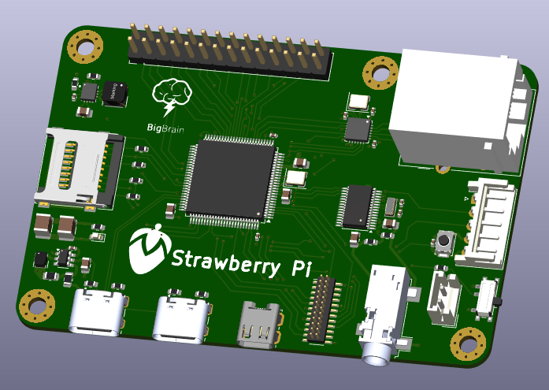
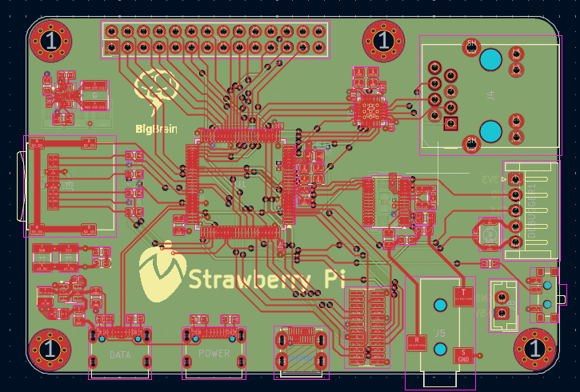

# 🍓 Strawberry Pi

A Raspberry Pi-4 form factor STM32 development board designed as a compact computing platform.

## Overview

Strawberry Pi is a custom 4-layer STM32-based development platform built around the **STM32H743** Cortex-M7 micro-controller.

The goal was to take the general concept of a small single-board computer and recreate it around a powerful micro-controller, integrating many useful interfaces and peripherals as possible into a compact Raspberry Pi 4 form factor.

The board is intended as a development and experimentation platform for hardware projects.

**SEE [SCHEMATICS](Strawberry_Pi-4.pdf)**

## Routing

## Features

### Core

- **STM32H743** Cortex-M7 MCU
- Up to **480 MHz** CPU clock
- MicroSD storage
- SWD debugging

### Connectivity

- **Ethernet**
- USB-C
- I2C
- SPI
- UART

### Multimedia

- Camera interface via **DCMI**
- Digital audio interface via **SAI**
- PCM1862 audio ADC
- 3.5 mm stereo audio input

### Power

The board provides dedicated:

- **5 V rail**
- **3.3 V rail**

## Rough BOM
1. PCB - $154.23 (JLCPCB)
2. SMD Resistors - $8.35 (Daraz Nepal)
3. SMD Capacitors - $7.98 (Daraz Nepal)
   Total - $170.56

## Authors 👥

### Shaurya (Electronics)

Contact: [Email](shauryatamang.dev@gmail.com)

### Krish (CAD)

View: [Github](https://github.com/unknowngamer69/)
